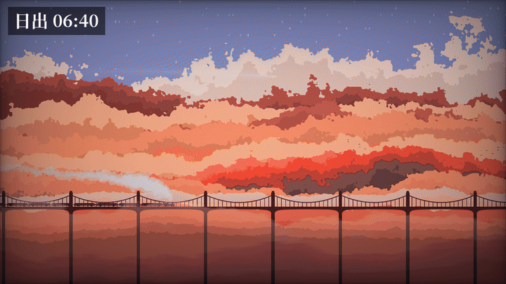
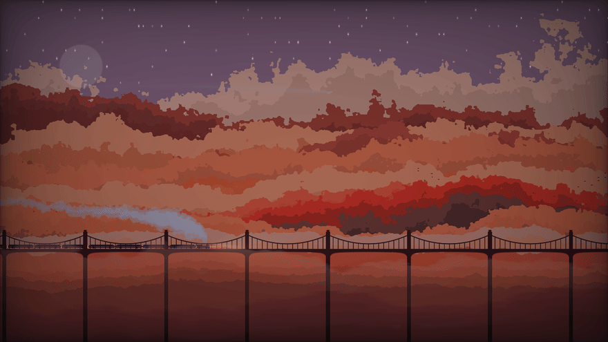
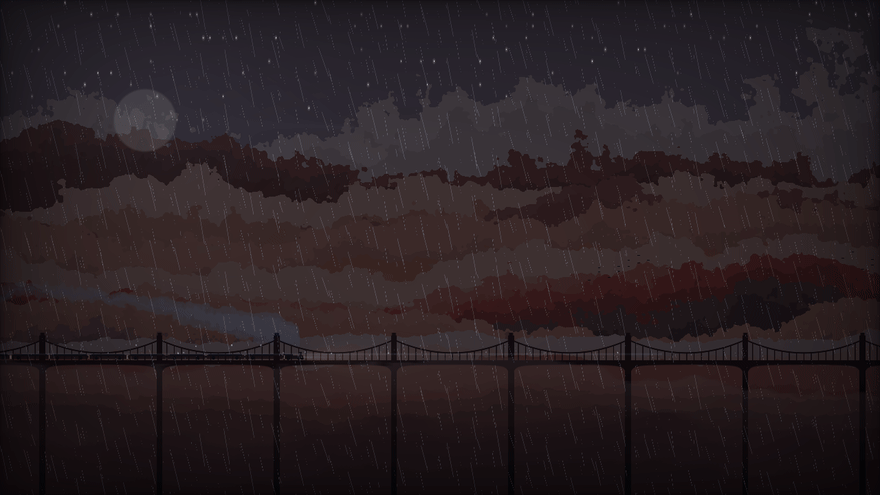

# 云间列车 · WebGL 着色器壁纸

实时渲染的云海列车场景，纯 WebGL 单文件实现。基于 Shadertoy 作品
[Traveling in the Cloud](https://www.shadertoy.com/view/Ndc3zl)（作者 Tianxiu Zhou）改造，
加入列车变速、昼夜循环、天气系统和自定义素材。



## 当前版本

**beta1** — 2026-09-21

## 时段与天气

所有时段和天气都是实时渲染、随本机时钟自动切换的。下面每组动图都是页面实际运行的录制。

### 时段（晴天）

| 日出 06:40 | 上午 09:30 | 正午 12:00 |
|---|---|---|
|  |  |  |

| 日落 18:00 | 夜晚 22:30 |
|---|---|
|  |  |

### 天气

| 雨（下午 15:30） | 雷暴（黄昏 18:30） | 夜雨（夜晚 22:30） |
|---|---|---|
|  |  |  |

## 功能

- **昼夜循环**：日出日落、黄昏暖调、月升月落带环形山，画面随本机时钟变化
- **天气**：雨（雨丝 + 车顶/桥面像素水花）、雷暴（闪电 + 云内辉光）、风（雨丝倾角、云层漂移）
- **星空**：程序化生成，约 100 颗带光晕的星点，夜里自动浮现
- **列车**：过桥变速，夜间车窗灯光、车头光柱
- **其他**：飞机尾迹（近端亮、远端渐宽渐淡）、飞鸟、云海多层视差、桥墩水花

## 参数面板

页面右上角「参数」按钮可实时调整缩放、偏移、速度、振幅、细节、雨量、雷暴、风力，
以及曝光、饱和度、色相、色温等后处理参数。

URL 参数：`?t=<秒>`（钉死时间便于截图）、`?tod=<0-24 或 0-1>`（时刻）、
`?rain=0-1&thunder=0-1&wind=-2..2`、`?ui=0`（隐藏面板）、`?wall=1`（壁纸模式，隐藏所有 UI）

## 文件说明

| 文件 | 说明 |
|---|---|
| `wallpaper/index.html` | 主程序，单文件自包含 |
| `wallpaper/blue_noise.png` | 噪声纹理，供着色器采样 |
| `docs/gifs/` | 时段与天气演示动图 |
| `src/` | Windows 壁纸宿主（C# / WebView2） |
| `installer/` | NSIS 安装脚本 |
| `CloudTrainWallpaper-Setup.exe` | 已编译安装包 |

## 部署

直接当网页跑：

```bash
python3 -m http.server 8099 --bind 0.0.0.0 --directory wallpaper
```

或双击 `CloudTrainWallpaper-Setup.exe` 装成 Windows 动态壁纸。

## 授权

原着色器版权归原作者 Tianxiu Zhou。改造部分由 Kyria 完成，仅供个人使用。
